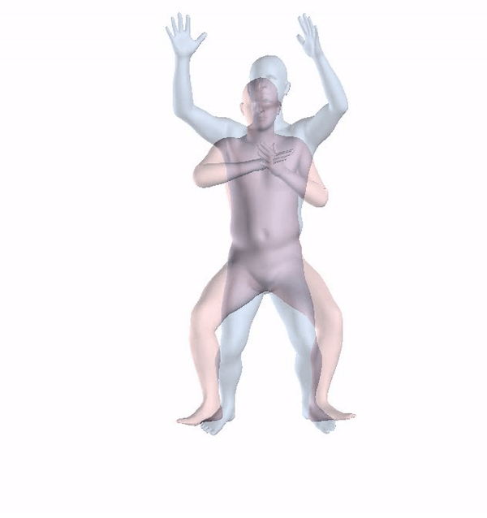

# Training-Pose
A final project for a B.Sc at computer science

Instructor: DR. Gil Ben Artzi

Presenters:  Yaara Goldenberg, Ester Reznikov

 ## The project goal:
 To help prevent injuries and improve the quality of people’s workouts without a trainer,
 by provide useful feedback on the user’s form.
 
 ## Introduction:
  Exercises are beneficial to health and fitness, 
  However, it is difficult for an individual to achieve the correct pose in training,
  it can also be very dangerous if performed incorrectly.
  Many people work out and perform exercises regularly but do not maintain the proper form (pose). 
  This could be due to a lack of formal training through classes or a personal trainer.
 
 ## Methods:
 There are 2 approaches for human body pose estimation- 2D and 3D.
 Today, the main methods are:
 
 OpenPose- can provide real-time 2D pose estimation using a nonparametric representation to learn the body parts in an image dataset. 
 
 SMPL- is a skinned vertex based model that accurately represents a wide variety of body shapes in natural human poses.
 
 The selected approach is 3D human body pose estimation using HMR- an end-to-end framework for reconstructing a full 3D mesh of a human body from a single RGB image, 
 that use the generative human body model SMPL, because 3D human model is easier for understanding target posture than 2D human model.
 
 ## Solution Description:
 We reconstructed a model called visual feedback that gives feedback on user movement using HMR and SMPL methods.
 The input of the system is a video of a person performing an exercise and the output is a video in which the person is
 presented as a 3D character with comparison to a 3D character who performs the exercise correctly.
 We improved the method by using DTW (dynamic time warping) so that the model is not only suitable for static exercises, and 
 normalize the characters so that the target character matches the source character so  that the difference between poses is 
 understandable to the user. The next step will be to give feedback using the “do as I do” motion transfer method.
 
 
